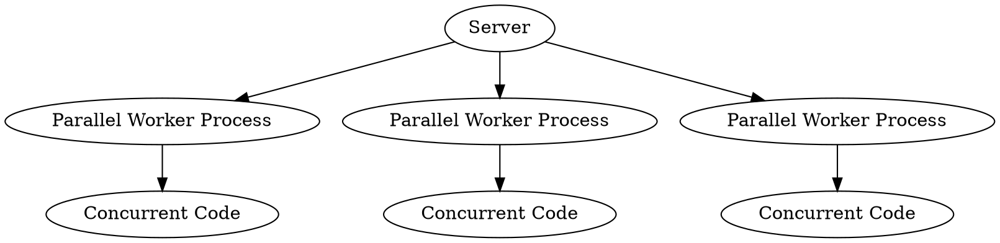

# Introduction to Swoole (and Asynchronous PHP)

Written by: 
[Mateusz Charytoniuk](https://www.linkedin.com/in/mateusz-charytoniuk)

## How is it Like to Code in Swoole?

### Coming in from Synchronous PHP

If you ask me what asynchronous programming looks like, I have to start with 
an invocation of an old joke.

Imagine two older men sitting on a bench on Sunday in front of a busy street, 
exchanging stories and constantly contradicting each other. One of them starts
telling the other one a story: 
- My friend tried jumping with a parachute.
- That's good!
- No, that's bad. He forgot a parachute.
- That's bad!
- No, that's good. He landed in a haystack.
- That's good!
- No, that's bad. There was a pitchfork in a haystack.
- That's bad!
- No, that's good. He missed the pitchfork.
- That's good!
- No, that's bad. He missed the haystack also.

If you ask me what it's like to use [Swoole](https://swoole.com), I can respond 
with a similar conversation:
- I just started using Swoole. Now, my website can handle multiple requests in
    parallel. It also has asynchronous coroutines (similar in concept to 
    [goroutines](https://go.dev/tour/concurrency/1)).
- That's good!
- No, that's bad! Now I have to deal with memory issues because 
    the script is now long-running, and popular libraries like 
    [Doctrine](https://www.doctrine-project.org), do not support 
    [Swoole](https://swoole.com) out of the box.
- That's bad!
- No, that's good. You can easily add [Swoole](https://swoole.com) adapters
    , and you can benefit from features like connection pools and 
    coroutines.
- That's good!
- No, that's bad! To deal with memory issues, you pretty much have to use 
    singletons.
- That's bad!
- No, that's good; those are not really singletons (...) etc, etc

The wonderful part of [Swoole](https://swoole.com) is, contrary to 
the first example, at the end of that cycle, you do not land on a pitchfork
(or on the hard ground near the pitchfork), but instead, you land in a cozy and
comfortable place.

## What Exactly is Swoole?

[Swoole](https://swoole.com) allows you to introduce asynchronous and 
parallel programming capabilities to PHP. 

It offers just the benefits of parallelism and concurrency while handling memory 
locks and other similar memory safety features under the hood. 

### Swoole's Most Important Features

- [Swoole](https://swoole.com) hooks into most IO PHP functions and makes them 
    work asynchronously (through a mechanism similar to 
    [Fibers](https://www.php.net/manual/en/language.fibers.php)).
    That means all your [PDO](https://www.php.net/manual/en/book.pdo.php)
    database queries, filesystem operations, and such automatically become
    asynchronous.

- [Swoole's](https://swoole.com) HTTP server starts multiple threads to handle
    requests in parallel. Each of those threads supports concurrent IO 
    operations. Everything happens transparently.

- It comes with built-in shared memory management features and inter-process
    communication features.

### Swoole HTTP Server Model (Simplified)

Concurrent code is relative to the process it's currently using. It's parallel 
in regard to other processes, but on top of that, it's asynchronous in the
context of the current process.



## What are the Good and Bad Parts of Long-Running PHP?

PHP is designed to have a minimal cold start time (which makes it perfect for
serverless functions, but that's another story). When your PHP server is 
long-running, you can instead spend normally unviable amounts of application
bootstrap time. 

That simplifies several things:

- The need to cache your application's kernel, configuration files, and other
    metadata (that are usually cached to make a quick cold start possible)
    is no longer there. It suddenly becomes viable to cache everything in 
    memory while your server starts (no more `php console.php cache:clear`).
- Similarly, using metaprogramming and class 
    attributes is much easier. 
    [Resonance Framework](https://resonance.distantmagic.com/)
    uses that approach extensively. It first indexes all the project files, 
    reads metadata from classes, and builds the 
    [Dependency Injection](https://resonance.distantmagic.com/docs/features/dependency-injection/) 
    container using that metadata.
- Precalculating temporary values in memory becomes much more viable since it 
    is no longer necessary to set up either [Redis](https://redis.io/) (or 
    similar solutions) to keep something persistent between requests.
- DNS resolution. If you are using microservices, you do not have to resolve
    DNS with each request. You can even keep a connection to your other
    microservices opened and just issue requests using that long-lived 
    connection with, in turn, makes them faster.

### That's Good! What's Bad?

The same feature also complicates several things that are not present in
synchronous, short-lived PHP scripts:

- PHP arrays were not designed with long-running processes in mind
    (see more at: 
    [Efficient data structures for PHP 7](https://medium.com/@rtheunissen/efficient-data-structures-for-php-7-9dda7af674cd)).
    They do not shrink when values are removed from them. That is normally not 
    an issue when handling short-lived scripts because they are usually 
    stopped after a limited number of requests.
- Starting just one database connection when your PHP 
    script starts and forgetting about it is no longer viable. In short-lived 
    scripts, it doesn't matter in the long run if one request fails to connect 
    to a database; the next one will try again. With 
    [Swoole](https://swoole.com), you must always keep the connection open. To 
    do that, you need to use
    [Connection Pools](https://wiki.swoole.com/#/coroutine/conn_pool?id=connectionpool).
- Using request-related global data is no longer possible. You can no longer 
    use superglobals like `$_GET`, `$_POST`, and similar ones. Instead, all
    the data is encapsulated in 
    [HTTP Request](https://wiki.swoole.com/#/http_server?id=swoolehttprequest) 
    object. You cannot extend the request object or add custom attributes. 

### That's Bad! What's Good?

- Luckily, PHP array issues can be mitigated with 
    [php-ds](https://github.com/php-ds/ext-ds?tab=readme-ov-file)
    extension.

    It also doesn't mean you should stop using PHP arrays; you 
    should be careful when using them in services and singletons.
- You do not have to tediously write a cleanup code that returns a connection 
    to the pool; you can instead use a simple wrapper to manage that for 
    you:

    ```php
    class DatabaseConnection
    {
        public PDOProxy $pdo;
        
        public function __construct(private ConnectionPool $connectionPool)
        {
            $this->pdo = $connectionPool->get();
        }

        public function __destruct()
        {
            $this->connectionPool->put($pdo);
        }
    }
    ```
    
    With that one simple trick (sorry for using the phrase "one simple trick")
    you can forget about putting connections back into the pool. When PHP's
    garbage collector collects the `DatabaseConnection` class, it will be 
    returned to the pool automatically.
- If you want to add some data related to a specific request, you can use
    PHP's [`WeakMap`](https://www.php.net/manual/en/class.weakmap.php)
    and 
    [`WeakReference`](https://www.php.net/manual/en/class.weakreference.php).
    It is entirely possible to architect your application around those types
    of collections, so when the current request is served and finished, all
    the garbage collector removes the related data.

    When using the following pattern, you can reuse request-related data 
    wherever `MyService` is used in your application:

    ```php
    class MyService
    {
        private WeakMap $requestData;
        
        public function __construct()
        {
            $this->requestData = new WeakMap();
        }

        public function doSomething(Request $request)
        {
            if ($this->requestData->offsetExists($request)) {
                return $this->requestData->offsetGet($request);
            }

            $something = $this->computeSomething();

            $this->requestData->offsetSet($request, $something);

            return $something;
        }

        private function computeSomething()
        {
            // ....
        }
    }
    ```

    You can also use Coroutine contexts to handle the issue.

    Alternatively, you can map [Swoole](https://swoole.com) requests into
    [PSR requests](https://www.php-fig.org/psr/psr-7) and use attributes.

### Readonly Classes

It's a good idea to make your entire code stateless (by which I do not 
mean avoiding HTTP sessions - not at all) to avoid mutating the state of your
classes as much as possible. That also means limiting the use of `array` (use
`php-ds` instead) in your service classes. In general, I found that using 
`readonly` classes and composing them to work well with Swoole helps avoid many 
issues with long-running and async code.

Now that we covered the fundamental issues of long-running PHP let's move to 
the asynchronous aspects.

## What are the Good and Bad Parts of Asynchronous PHP?

The most obvious are performance benefits. Each worker process can handle
multiple requests concurrently. When one of them makes an SQL query or tries
to open a file, it yields control to a different incoming request. When
that SQL query or different IO operation finishes, it resumes. That allows us 
to maximize CPU usage and minimize idle times.

Asynchronous aspects are transparent unless you explicitly want to use 
coroutines.

### What are Coroutines?

Coroutines are really similar in concept to 
[goroutines](https://go.dev/tour/concurrency/1). Those lightweight 
thread-like utilities force certain pieces of code to run concurrently
(so you can manually yield/resume the worker thread control). Usually, you do 
not have to use them manually; you can configure the HTTP server to start a 
new coroutine for each incoming request.

```php
$wg = new WaitGroup(2);

go(function () use ($wg) {
    // do something concurrently
    $wg->done();
});

go(function () use ($wg) {
    // do something concurrently
    $wg->done();
});

// wait until all coroutines finish
$wg->wait();
```

That's all good, but there is something that makes coroutines even better:
Channels.

### Channels

You can define channels in multiple ways. If you know JavaScript, they are
similar to 
[MessageChannel](https://developer.mozilla.org/en-US/docs/Web/API/MessageChannel). 
If you know Go, they are similar to Go's... 
[channels](https://go.dev/tour/concurrency/2).

The way I think about them and what makes them one of the most incredible things
about async programming is that they turn a stream of events into an iterator. I
see that as an essential and core feature of channels in general (no matter 
the programming langage).

Let me explain.

For example, let's say you have an event listener. Without channels and 
asynchronicity, you are bound to use callbacks:

```php
$eventDispatcher = new EventDispatcher();

$eventDispatcher->addEventListener('fooEvent', function (FooEvent $evt) {
    // do something with the event
});

$eventDispatcher->dispatch(new FooEvent());
$eventDispatcher->dispatch(new FooEvent());
```

With the help of channels, you can convert events into streams or generators,
which, to me, is a true beauty of them. For example:

```php
function toGenerator(EventDispatcher $eventDispatcher, string $eventName): Generator
{
    $channel = new Channel();
    
    go(function () use ($eventName) {
        $eventDispatcher->addEventListener($eventName, function ($event) {
            $channel->push($event);
        });
    });

    while (true) {
        yield $channel->pop();
    }
}

foreach (toGenerator($eventDispatcher, 'fooEvent') as $event) {
    // do something with the event
}
```

That means suddenly, from the world of callbacks, you have fallen into the 
world of 
[Generators](https://www.php.net/manual/en/language.generators.overview.php), 
for which there are not that many uses in synchronous PHP besides the memory 
savings. Now, they gain additional functions - then can help you shape the flow 
of data in your application, even if its asynchronous.

### That's all Good, but what's Bad?

Call me biased, but I don't see anything bad about asynchronous features. 
All of them are optional, so if you mess something up, it's on you, not on 
[Swoole](https://swoole.com) (unless you find some obvious bug).

I think [Swoole](https://swoole.com) does a really good job of handling all the 
risky aspects of memory management behind the scenes and exposing just the safe 
parts.

Now that we have covered the basics of async, what about parallel processes?

## What are the Good and Bad Parts of Using Multiple Processes in PHP?

That is where things get more complicated. Normally, there is no reason to 
delve into multi-process scripts unless you need to speed up some computations 
and maximize the CPU usage
(see: 
[Swoole Backend in RubixML](https://github.com/RubixML/ML/blob/a354df50ab0d9c31295640dabd9a017767c6d0cb/src/Backends/Swoole.php))
or, for some other reason, you need full parallelism.

The other good part is that you can easily encapsulate some other PHP script in 
a process ([Swoole](https://swoole.com) provides a convenient wrapper for 
that).

```php
$process = new Process(function () {
    // this executes in parallel
});
$process->start();

// wait until process finishes
$process->wait();
```

Pretty simple, right?

### That's Great! What's Bad?

Once you start to deal with processes, you will likely have to delve into
inter-process communication techniques (like Unix sockets) or shared memory
management. Coroutine channels won't cut it - they are a single process thing.

For example, let's assume you want to close all the `WebSocket` connections
active in the current [Swoole](https://swoole.com) server.
Connection handles are scattered across multiple processes. What now?

### That's Bad! What's Good?

[Swoole](https://swoole.com) is a mature library and has most of those cases
covered. 

For example, if you want to make a list of all opened `WebSocket` connections, 
you can use `Table`, which is a shared memory view (kind of similar to 
[JavaScript's TypedArray](https://developer.mozilla.org/en-US/docs/Web/JavaScript/Reference/Global_Objects/TypedArray)), 
but also combining some aspects of key-value store.

Let's create the table before the server starts:

```php
// You can determine the maximum possible connections by knowing the  server 
// and kernel limits.
$table = new Table($maxPossibleConnections);
$table->column('worker_id', Table::TYPE_INT);
$table->create();
```

Now, after the server starts, you can store the opened connections in the table 
(from a worker thread):

```php
// $fd is the WebSocket connection file descriptor (id)
$table->set((string) $fd, [
    'worker_id' => $workerId,
]);
```

In the end, if you want to close the connections, you can iterate over the 
table:

```php
foreach ($table as $fd => $row) {
    $server->close($fd);
}
```

## That's all Good, But...?

That's true; it's all good in the end. The good news is that there is a clean 
solution for every issue we encounter.

We are left with a functional parallel processing library that can handle 
classical sites and asynchronous streams, WebSockets, and low-level protocols 
without workarounds or additional measures like job queues.

There is a small price to pay here and there, but the overall benefits are 
tremendous. We landed in a cozy place.
